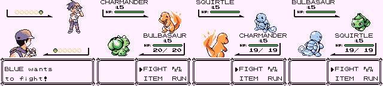

# Pokémon Red★ and Blue★

This is a custom Pokémon game based on [the Pokémon Red and Blue disassembly](https://github.com/pret/pokered).

It started out as a graphics upgrade, replacing the Pokémon sprites with the ones from [the Space World 1997 G/S prototypes](https://github.com/pret/pokegold-spaceworld). Then I ported more content, including overworld tile and sprite graphics, Pokémon genders, shiny Pokémon, and more. I also ended up making all 151 Pokémon available in one game.

For a full list of features, see [**FEATURES.md**](FEATURES.md).

## Download and Play

To set up the repository, see [**INSTALL.md**](INSTALL.md).

It builds the following ROMs:

* redstar.gbc  `md5: c16c643fae4e6d38d2fb019400c65435`
* bluestar.gbc `md5: d2a806d815c55e6a5e160995a5880ab4`

If you can't build the repository yourself, you can download these IPS patches and apply them to a clean ROM with a tool like [Lunar IPS](https://fusoya.eludevisibility.org/lips/).

* [pokered.ips](patches/pokered.ips):  apply to Pokemon Red (UE) [S][!].gb  `md5: 3d45c1ee9abd5738df46d2bdda8b57dc`
* [pokeblue.ips](patches/pokeblue.ips): apply to Pokemon Blue (UE) [S][!].gb `md5: 50927e843568814f7ed45ec4f944bd8b`

## Screenshots

## See also

Other hacks:

* [Pokémon Polished Crystal](https://github.com/Rangi42/polishedcrystal)
* [Pokémon Red++](https://github.com/TheFakeMateo/RedPlusPlus/)
* [Pokémon Orange](https://github.com/PiaCarrot/pokeorange)

Discord servers:

* [Rangi](https://discord.gg/ZK5pqK8)
* [Lunaverse](https://discord.gg/SQwkd7r)
* [Pia Carrot](https://discord.gg/UKTyj3t)

pret projects:

* [pokered](https://github.com/pret/pokered)
* [pokegold-spaceworld](https://github.com/pret/pokegold-spaceworld)
* [pokeyellow](https://github.com/pret/pokeyellow)
* [pokecrystal](https://github.com/pret/pokecrystal)

More info:

* [The Cutting Room Floor](https://tcrf.net/Proto:Pok%C3%A9mon_Gold_and_Silver)
